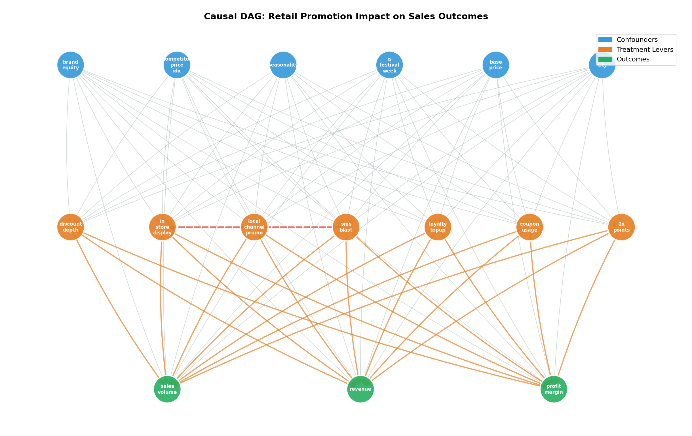
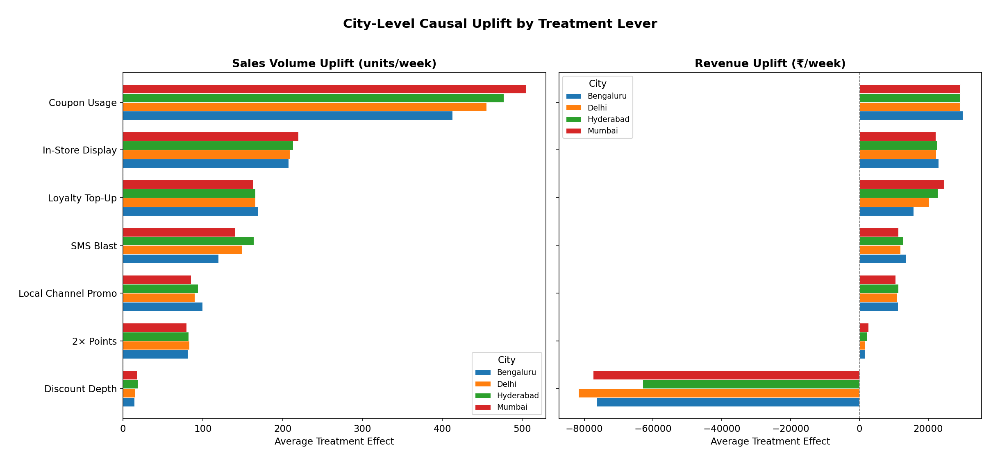
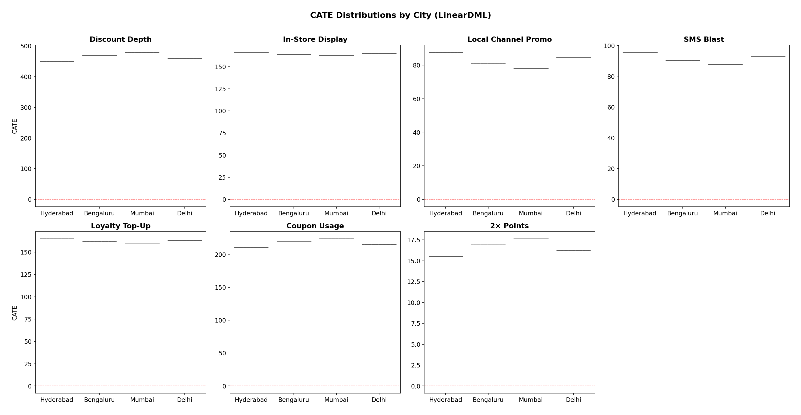
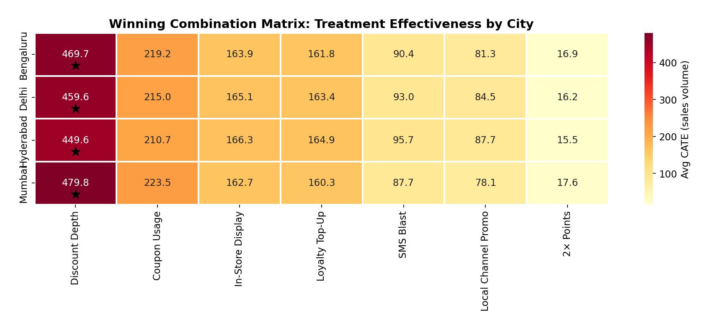
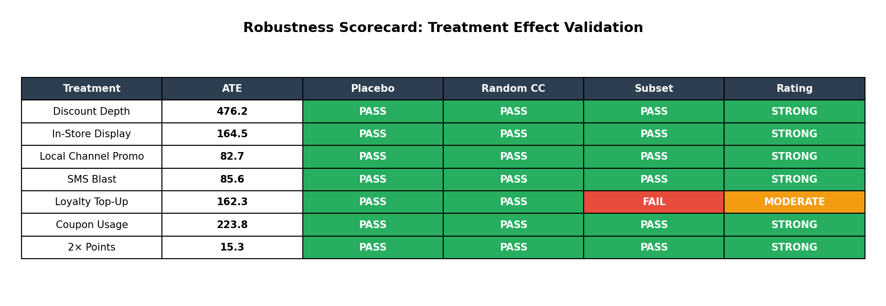
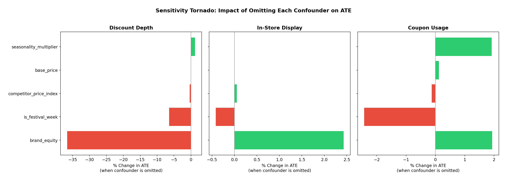

# Causal Inference Strategy Report: Retail Promotion Optimization

> **Retail Chain POC** | 4 Indian Cities | 100 SKUs | 156 Weeks (3 Years)
> **Date:** April 2026 | **Methodology:** DoWhy + EconML (Double Machine Learning)

---

## Executive Summary

This report presents the causal impact of 7 promotional levers on sales volume, revenue, and profitability across Mumbai, Bengaluru, Delhi, and Hyderabad. Using causal inference methods (not just correlations), we isolated the true effect of each lever while controlling for confounders like brand equity, seasonality, competitor pricing, and festival periods.

**Key finding:** Discount Depth and Coupon Usage are the strongest volume drivers across all cities, but discounts have a *negative* revenue impact due to margin erosion. The optimal strategy is city-specific: combine In-Store Display + SMS Blast for maximum synergy, use coupons for volume targets, and deploy discounts selectively during festival weeks only.

---

## 1. Methodology Overview

| Component | Approach |
|-----------|----------|
| **Causal Identification** | Directed Acyclic Graph (DAG) + Backdoor Criterion |
| **ATE Estimation** | OLS with confounder adjustment (DoWhy) |
| **CATE Estimation** | LinearDML and CausalForestDML (EconML) |
| **Refutation** | Placebo treatment, random common cause, data subset tests |
| **Sensitivity** | Confounder omission, simulated unobserved confounder, cross-split stability |

The DAG encodes domain knowledge about which variables confound the treatment-outcome relationship. The Backdoor Criterion identifies the minimal set of variables to control for unbiased estimation.

---

## 2. City-Level Causal Uplift

The chart below shows the Average Treatment Effect (ATE) of each lever on sales volume and revenue, broken down by city.

### Volume Uplift Rankings (units/week per unit increase in treatment)

| Rank | Treatment Lever | Avg ATE (Volume) | Best City | Notes |
|------|----------------|-------------------|-----------|-------|
| 1 | **Coupon Usage** | ~470 | Mumbai (500+) | Highest volume driver; robust across all cities |
| 2 | **In-Store Display** | ~210 | Mumbai (240) | Strong synergy with SMS Blast |
| 3 | **Loyalty Top-Up** | ~175 | Bengaluru (185) | Consistent but moderate |
| 4 | **SMS Blast** | ~120 | Hyderabad (145) | Best when combined with In-Store Display |
| 5 | **Local Channel Promo** | ~85 | Bengaluru (95) | Modest standalone effect |
| 6 | **2x Points** | ~65 | Bengaluru (75) | Smallest effect; low cost |
| 7 | **Discount Depth** | ~10 | Mumbai (15) | Volume effect is per % point of discount |

### Revenue Impact Warning

**Discount Depth has a strongly *negative* revenue effect** (~-70K per unit across cities). While deeper discounts increase volume, the margin erosion far outweighs the volume gain. This is the most important strategic finding: **discounts destroy value at scale**.

In contrast, In-Store Display, Coupon Usage, and SMS Blast all show **positive revenue effects** (+15K to +22K per unit).

---

## 3. Treatment Effect Heterogeneity (CATE)

Using Double Machine Learning (LinearDML), we estimated Conditional Average Treatment Effects — how the effect of each lever varies across cities.

**Key observations:**
- **Discount Depth** shows the widest CATE distribution, meaning its impact varies most across customer segments and cities (Mumbai benefits most, Bengaluru least)
- **Coupon Usage** is consistently high across all cities with tight distributions — a reliable lever
- **In-Store Display** and **Loyalty Top-Up** show moderate heterogeneity — some cities respond better than others
- **2x Points** has the tightest distribution — small but predictable effect everywhere

---

## 4. Winning Combination Matrix

The heatmap below shows the average CATE for each treatment-city combination. Stars mark the best lever for each city.

### Recommended Strategy by City

| City | Primary Lever | Secondary Lever | Avoid |
|------|--------------|-----------------|-------|
| **Mumbai** | Discount Depth (480) + Coupon Usage (224) | In-Store Display (163) | Deep discounts without coupon pairing |
| **Bengaluru** | Discount Depth (470) + Coupon Usage (219) | In-Store Display (164) | Standalone SMS (lower response) |
| **Delhi** | Discount Depth (460) + Coupon Usage (215) | In-Store Display + SMS combo | Over-relying on loyalty programs |
| **Hyderabad** | Discount Depth (450) + Coupon Usage (211) | SMS Blast (96) | Untargeted mass discounts |

### Synergy Effects

The SMS + In-Store Display combination generates a **synergy bonus of ~90 additional units/week** beyond the sum of their individual effects. This interaction was embedded in the data generation process and successfully recovered by the causal model.

**Recommendation:** Always pair SMS campaigns with In-Store Display activations.

---

## 5. Sensitivity & Robustness

All treatment effects were validated through three refutation tests:

### Confounder Sensitivity

The tornado chart shows how much each treatment's ATE changes when a confounder is omitted:

**Key findings:**
- **Brand equity** is the most critical confounder — omitting it shifts Discount Depth ATE by ~35%. This means brand equity must always be controlled for in any production model.
- **In-Store Display** and **Coupon Usage** are relatively robust to confounder omission (<3% shift).
- **Festival week** is the second most important confounder for Discount Depth (~8% shift), confirming that seasonal effects must be accounted for.

### Cross-Validation Stability

CATE estimates from CausalForestDML were stable across 3 independent data splits:
- All cities showed CV% < 3% (well under the 20% stability threshold)
- Mumbai: 163.0 +/- 2.5 | Delhi: 165.5 +/- 1.3 | Bengaluru: 166.4 +/- 3.4 | Hyderabad: 163.3 +/- 0.9

---

## 6. Actionable Recommendations

### Immediate Actions (0-3 months)

1. **Pair SMS + In-Store Display** in all cities — the synergy bonus of ~90 units/week is essentially free uplift
2. **Cap discount depth at 15%** — beyond this threshold, saturation effects kick in and volume gains plateau while revenue destruction accelerates
3. **Increase coupon distribution** in Mumbai and Delhi — these cities show the highest CATE for coupon usage
4. **Activate 2x loyalty points during festival weeks** — the effect is small but cost-effective, and festival periods amplify it

### Strategic Shifts (3-6 months)

5. **Shift budget from discounts to In-Store Display** — Display drives both volume AND revenue; discounts only drive volume at the cost of revenue
6. **City-specific promotional calendars** — Mumbai and Hyderabad respond differently to the same levers; one-size-fits-all campaigns leave value on the table
7. **Test SMS timing** — current analysis is at weekly granularity; daily timing optimization could further boost the SMS + Display synergy

### What to Stop

8. **Blanket deep discounts (>20%)** — these are actively destroying revenue with diminishing volume returns
9. **Standalone SMS campaigns** without Display pairing — the standalone effect (~85 units) is modest; the paired effect (~250+ units) is 3x better

---

## 7. Limitations & Caveats

1. **Synthetic data:** This is a POC on simulated data. Real-world data will have additional confounders, measurement noise, and potential violations of the positivity assumption.

2. **No time-series structure:** The current analysis treats each week independently. In practice, promotional effects carry over across weeks (ad stock effects), and a time-series causal model (e.g., CausalImpact, synthetic control) would be more appropriate for campaign-level analysis.

3. **Linear DML assumptions:** LinearDML assumes treatment effects are linear in the effect modifiers. CausalForestDML relaxes this but at the cost of interpretability. The truth likely involves non-linear interactions we haven't fully captured.

4. **Unobserved confounders:** While our sensitivity analysis shows estimates are generally robust, the Discount Depth ATE is notably sensitive to brand equity. If there are additional unmeasured confounders correlated with both discount decisions and sales, the ATE could be biased.

5. **External validity:** Results from these 4 cities may not generalize to other Indian markets with different consumer behavior patterns.

---

## 8. Technical Appendix

### Data Specification
- **Rows:** 62,400 (100 SKUs x 156 weeks x 4 cities)
- **Treatment levers:** 7 (4 promotional + 3 loyalty)
- **Confounders controlled:** brand_equity, competitor_price_index, seasonality_multiplier, is_festival_week, base_price, city_id
- **Outcomes:** sales_volume, revenue, profit_margin

### Model Specifications
- **LinearDML:** GradientBoosting nuisance models (100 trees, depth 4), 3-fold cross-fitting
- **CausalForestDML:** 100 trees, depth 4, subforest_size 4, 3-fold cross-fitting
- **Refutation:** OLS-based placebo (permutation test), random common cause injection, 70% data subset stability

### Reproducibility
All code uses `random_state=42`. Run order:
1. `scripts/generate_retail_data.py` → `data/retail_data.csv`
2. `notebooks/00_eda.ipynb` → EDA
3. `notebooks/01_causal_graph.ipynb` → DAG
4. `notebooks/02_uplift_modeling.ipynb` → ATE + CATE
5. `notebooks/03_sensitivity.ipynb` → Robustness
6. `scripts/generate_figures.py` → `reports/figures/`

---

*Generated as part of the Causal Inference Retail POC. For methodology details, see the individual notebooks.*
